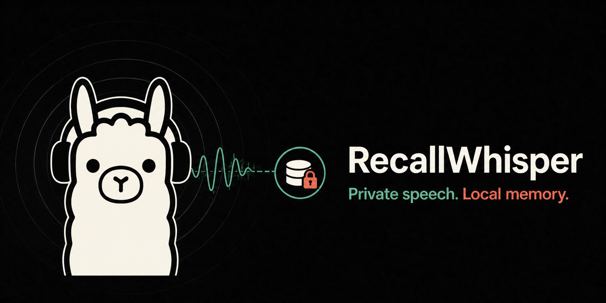

<p align="center">
  
</p>

# RecallWhisper

[English](README.md)

一款私密的 Android 环境语音采集与摘要应用，所有持久化数据都存储在手机上。

## 数据流

```text
麦克风 → 加密的本地 WAV → 转录 API
       → 本地原始转录文本 → 摘要 API
       → 本地摘要/搜索/导出
```

- 原生 Kotlin 前台服务和快捷设置磁贴
- Silero VAD，可配置 5–60 秒的对话暂停容忍时间
- 每个文件使用由 Android Keystore 包装的 AES-256-GCM 密钥
- Room 元数据、原始转录响应、转录文本和摘要
- 直接使用 OpenAI 兼容的转录和摘要接口
- 默认仅通过 Wi-Fi 处理；蜂窝网络需要手动启用
- 本地播放、转录文本搜索、删除、API 调试工具和 JSON 导出

## 配置 RecallWhisper

在“设置”中分别配置转录和摘要的 URL、令牌及模型。每个 URL 都必须包含
`/v1` API 前缀。除非明确启用 **允许不安全的 HTTP**，否则必须使用 HTTPS；该选项仅适用于受信任的开发网络。

“调试和 API 调试工具”可以列出摘要模型、编辑本地系统提示词、发送任意文本、调整生成参数，并查看响应延迟和错误。该页面还包含经过身份验证的转录服务器健康检查和模型发现检查。

“将所有数据导出为 JSON”会打开 Android 文档选择器，并将片段元数据、原始转录结果、转录文本、摘要、处理状态和校验和写入用户选择的文件。音频仍会单独加密并保存在应用私有存储中。

## 自托管处理示例

此示例使用两个相互独立的本地服务：

```text
RecallWhisper
  ├─ /v1/audio/transcriptions → OpenASR + X-ASR zh/en
  └─ /v1/chat/completions     → llama.cpp + Qwen3.5 4B GGUF
```

这种分离是有意设计的：RecallWhisper 会分别保存转录和摘要的 URL、Bearer
令牌及模型 ID。

### 1. 使用 X-ASR zh/en 运行 OpenASR

从 [OpenASR 发布页](https://github.com/QuintinShaw/openasr/releases) 安装当前的
`openasr` 二进制文件，然后拉取推荐的 Q8 双语 X-ASR 模型包：

```sh
openasr pull xasr-zh-en:q8
openasr transcribe sample.wav --model xasr-zh-en
```

[X-ASR 模型卡片](https://huggingface.co/OpenASR/xasr-zh-en)介绍了 `fp16`、`q8` 和
`q4` 模型包。Q8 是实用的默认选择；如果内存更紧张，可以使用 Q4。

创建 Bearer 令牌并启动服务器：

```sh
openasr apikey create --name recallwhisper
export OPENASR_TOKEN='replace-with-the-created-token'
openasr serve --help
openasr serve --addr 0.0.0.0:9099 --model xasr-zh-en --pairing-admin-token-env OPENASR_TOKEN
```

请在 API 密钥显示时保存它；RecallWhisper 会将其用作转录令牌。此示例使用 9099
端口，以避免与 8080 端口上的 llama.cpp 冲突；OpenASR 的默认地址是
`127.0.0.1:8080`。在绑定到回环地址之外的接口前，请查阅 [OpenASR 服务器文档](https://openasr.org/docs/server/)：远程服务需要身份验证和 TLS/配对。该服务器会提供 RecallWhisper 所调用的 OpenAI 兼容 `/v1/models` 和 `/v1/audio/transcriptions` 路由。

### 2. 使用 Qwen3.5 4B GGUF 运行 llama.cpp

官方的 [Qwen3.5 4B 模型](https://huggingface.co/Qwen/Qwen3.5-4B)本身不包含
GGUF 文件。本示例使用 Unsloth 的 [Qwen3.5-4B GGUF 仓库](https://huggingface.co/unsloth/Qwen3.5-4B-GGUF)及其 2.74 GB 的 `Q4_K_M` 量化版本。

创建工作目录，下载模型并生成 API 密钥：

```sh
mkdir -p recallwhisper-llm/models
cd recallwhisper-llm

curl -fL \
  'https://huggingface.co/unsloth/Qwen3.5-4B-GGUF/resolve/main/Qwen3.5-4B-Q4_K_M.gguf?download=true' \
  -o models/Qwen3.5-4B-Q4_K_M.gguf
```

在 `recallwhisper-llm/` 中创建 `compose.yaml`，内容如下，并将 `<SET_YOUR_LLAMA_API_KEY>` 替换为安全的值：

```yaml
services:
  llama:
    # 根据主机硬件从以下镜像中选择一个。
    image: ghcr.io/ggml-org/llama.cpp:server    # 仅 CPU 镜像
    # image: ghcr.io/ggml-org/llama.cpp:server-cuda   # NVIDIA GPU 主机
    # image: ghcr.io/ggml-org/llama.cpp:server-vulkan # AMD/Intel GPU 主机
    restart: unless-stopped
    ports:
      - "8181:8080"
    volumes:
      - ./models:/models:ro
    environment:
      LLAMA_API_KEY: <SET_YOUR_LLAMA_API_KEY>
    command:
      - --model
      - /models/Qwen3.5-4B-Q4_K_M.gguf
      - --alias
      - qwen3.5-4b
      - --host
      - 0.0.0.0
      - --port
      - "8080"
      - --ctx-size
      - "16384"
      - --parallel
      - "1"
      - --reasoning
      - "off"
    # 对于 AMD 或 Intel GPU 主机，取消以下几行的注释以启用 Vulkan GPU 卸载：
    # devices:
    # - /dev/null:/dev/null
    # 对于 NVIDIA GPU 主机，取消以下几行的注释以启用 CUDA GPU 卸载：
    # deploy:
    #   resources:
    #     reservations:
    #       devices:
    #         - capabilities: [gpu]
```

启动服务：

```sh
docker compose up -d
```

这里使用的是 llama.cpp 仅服务器镜像，详见官方 [Docker 指南](https://github.com/ggml-org/llama.cpp/blob/master/docs/docker.md)。`--alias` 的值会成为 `/v1/models` 返回的模型 ID。使用 `--reasoning off` 可以配合 RecallWhisper 的非思考摘要请求。有关 API 密钥、TLS、GPU 卸载、上下文和并发选项，请参阅 [llama.cpp 服务器参考](https://github.com/ggml-org/llama.cpp/blob/master/tools/server/README.md)。

对于 GPU 主机，可以使用 `ghcr.io/ggml-org/llama.cpp:server-cuda` 或
`ghcr.io/ggml-org/llama.cpp:server-vulkan`。如果可移植性比生成速度更重要，请保留 CPU 镜像。

### 3. 安全地暴露两个 API

不要将任一纯 HTTP 端口直接发布到互联网。可以使用小型反向代理来终止受信任的 HTTPS，同时让两个推理服务器继续绑定到回环地址。使用上述端口时，[Caddy 反向代理](https://caddyserver.com/docs/quick-starts/reverse-proxy)配置可以简单到：

```caddyfile
asr.example.com {
    reverse_proxy 127.0.0.1:9099
}

llm.example.com {
    reverse_proxy 127.0.0.1:8080
}
```

即使位于代理之后，也请保持 OpenASR 和 llama.cpp 的身份验证启用。如果确实要使用私有局域网 HTTP，请将所需服务端口绑定到局域网接口，使用防火墙限制为受信任客户端，并在 RecallWhisper 中启用 **允许不安全的 HTTP**。该设置会允许音频和 Bearer 令牌以未加密形式在网络中传输，因此不适用于公共或不受信任的网络。

### 4. 在 RecallWhisper 中填写设置

| 设置 | 示例 |
| --- | --- |
| 转录 URL | `https://asr.example.com/v1` |
| 转录令牌 | `openasr apikey create --name recallwhisper` 生成的令牌 |
| 转录模型 | `xasr-zh-en` |
| 摘要 URL | `https://llm.example.com/v1` |
| 摘要令牌 | `compose.yaml` 中的 `<SET_YOUR_LLAMA_API_KEY>` |
| 摘要模型 | `qwen3.5-4b` |
| 摘要语言 | “与转录文本相同”或指定语言 |

保存设置，然后打开 **调试和 API 调试工具**。启用持续处理前，请验证转录健康检查、加载摘要模型列表，并发送一个简短的 JSON 模式测试。

### 故障排除

- **任一服务器返回 404：** 配置的 URL 可能遗漏了 `/v1`，或添加了 RecallWhisper 会自行拼接的端点路径。
- **401 Unauthorized：** 分别检查转录令牌和摘要令牌；它们是有意分开配置的。
- **拒绝明文 HTTP：** 使用受信任的 HTTPS，或者仅在受控的开发局域网中明确启用不安全 HTTP。
- **TLS 证书错误：** 使用 Android 信任的证书。启用不安全 HTTP 不会关闭 HTTPS 证书验证。
- **找不到模型：** 检查 `/v1/models`。RecallWhisper 中配置的模型必须与 `xasr-zh-en` 或 llama.cpp 的 `--alias` 完全一致。
- **没有最终摘要文本：** 按示例保持 Qwen 思考功能关闭。RecallWhisper 需要 `choices[0].message.content` 中的最终内容，而不是只有 reasoning 字段。
- **容器启动时退出：** 检查 `docker compose logs llama`，确认 GGUF 路径和权限，并更新 llama.cpp 镜像，因为 Qwen3.5 支持需要较新的构建版本。

## 构建

```sh
flutter analyze
flutter test
flutter build apk --release --split-per-abi
```
